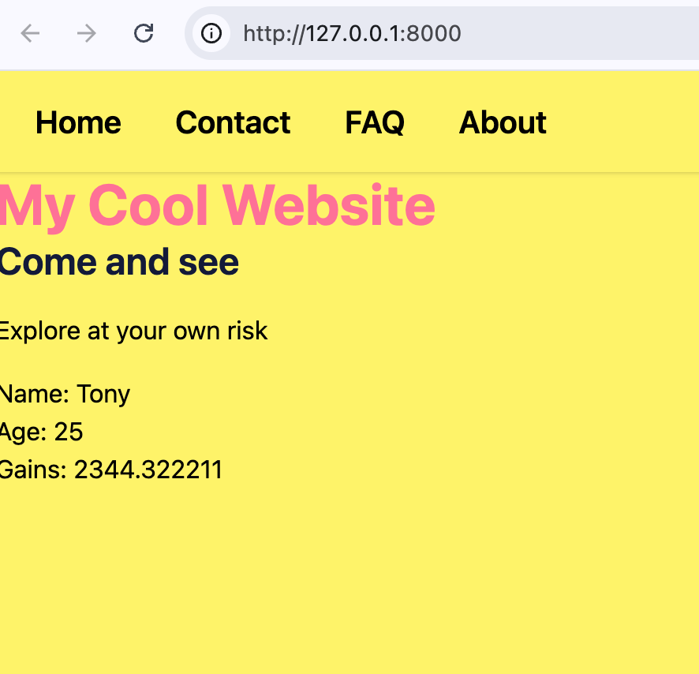
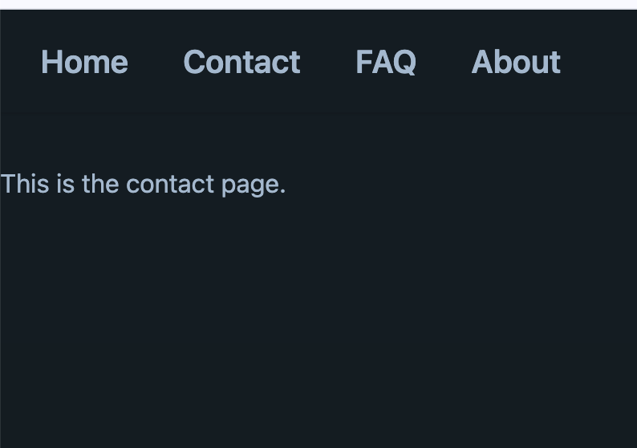
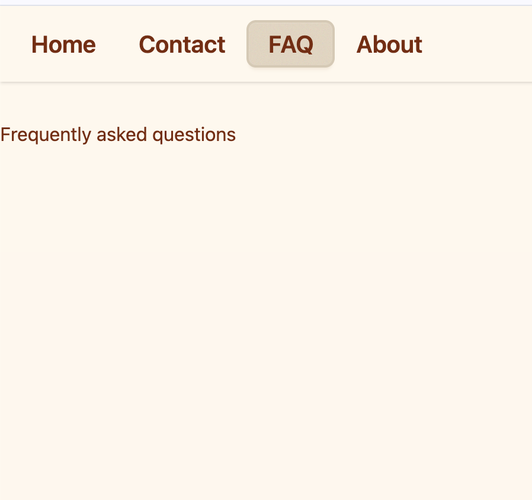
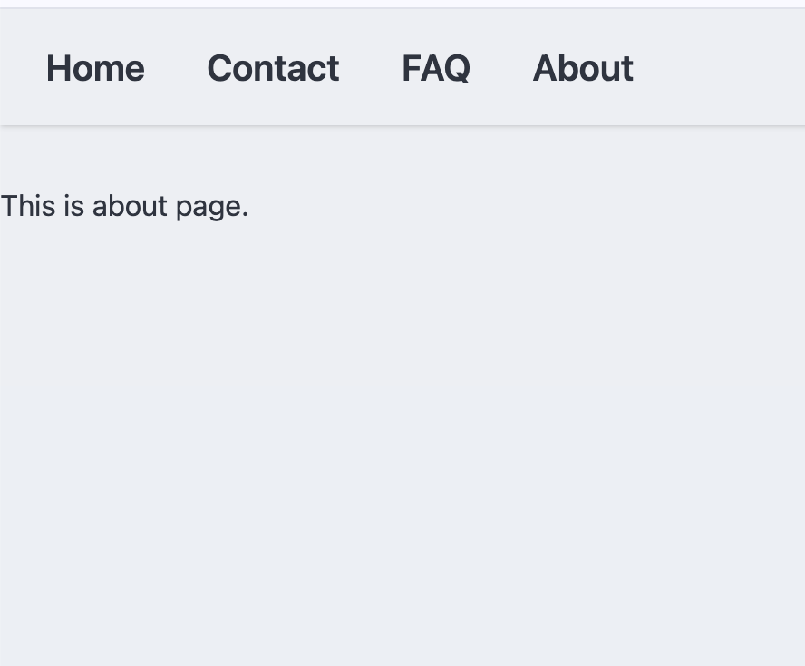

# 🌐 Django Static & Template Manager(Class 21)

This project implements a 4-page Django site using **Template Inheritance** and **DaisyUI**. It focuses on passing various data types through context and managing static assets.

---

## ✅ Project Checklist

- [x] **Settings:** Configured `TEMPLATES` and `STATICFILES_DIRS`.
- [x] **Inheritance:** Created `base.html` and 4 extended child templates.
- [x] **Themes:** Applied 4 different DaisyUI themes (Light, Dark, Cupcake, Bumblebee).
- [x] **Data:** Passed variables, a list (len 6), and a dictionary (len 5) to each page.
- [x] **Logic:** Used `` loops to display list and dictionary data.

---

## 💻 Core Implementation

### 1. `config/settings.py`
```python
INSTALLED_APPS = [
    'django.contrib.admin',
    'django.contrib.auth',
    'django.contrib.contenttypes',
    'django.contrib.sessions',
    'django.contrib.messages',
    'django.contrib.staticfiles',
    'static_pages_templates', 
]

TEMPLATES = [
    {
        'BACKEND': 'django.template.backends.django.DjangoTemplates',
        'DIRS': [ BASE_DIR / 'templates' ],
        'APP_DIRS': True,
        'OPTIONS': {
            'context_processors': [
                'django.template.context_processors.request',
                'django.contrib.auth.context_processors.auth',
                'django.contrib.messages.context_processors.messages',
            ],
        },
    },
]

STATICFILES_DIRS = [
    BASE_DIR / 'static',
]
```

### 2. `static_pages_templates/views.py`
```python
from django.shortcuts import render

ef home(request):
    ctx = {
        'name': "Tony",
        'age': 25,
        'gains': 2344.322211,
        'skills': ['Python', 'Django', 'Tailwind', 'SQLite', 'Docker', 'Git'],
        'info': {
            'Location': 'Seoul',
            'Role': 'Developer',
            'Status': 'Active',
            'Project': 'Static Site',
            'Engine': 'Django 5.0'
        }
    }
    return render(request, 'static_pages_templates/home.html', ctx)

```

### 3. `config/urls.py`
```python
from django.contrib import admin
from django.urls import path
from static_pages_templates import views

urlpatterns = [
    path('', views.home, name="home"),
    path('contact/', views.contact, name="contact"),
    path('faq/', views.faq, name="faq"),
    path('about/', views.about, name="about"),
]
```

---

## 📸 Screenshots
| Page | Applied Theme | Screenshot Preview |
| :--- | :--- | :--- |
| **Home** | cyberpunk |  |
| **Contact** | sunset |  |
| **FAQ** | caramellatte |  |
| **About** | nord |  |

---

## 🔗 Project Links
- **Repository:** https://github.com/lazy-h-null/my-exercise-archive/tree/main/21-apr15
```